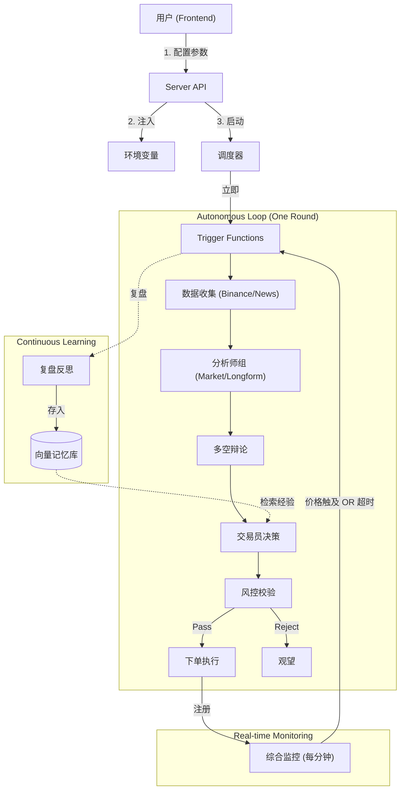

# TradingAgents System Workflow

本文档详细描述了 TradingAgents 系统的完整工作流，从前端的用户配置驱动，到后端的调度执行，再到智能体的自主决策与复盘闭环。

## 1. 系统驱动层 (Frontend Driver)

一切始于 Web 前端的用户交互。

-   **配置入口**: 用户在 `HomePage` 侧边栏填写关键参数：
    -   **资产列表 (`assets`)**: 指定要交易的目标（如 `BTCUSDT,ETHUSDT`）。
    -   **资金配置**: `available_capital` (本金), `min/max_leverage` (杠杆范围)。
    -   **自定义周期**: 仅影响 K 线图表查询周期（`/api/klines`），不改变调度器的任务频率。
-   **指令发送**:
    -   当用户点击 **"启动调度"** 按钮时，前端将上述状态打包为 JSON Payload (`RunRequest`)。
    -   通过 POST 请求发送至后端接口: `/api/scheduler/start`。
    -   点击 **"停止"** 触发 `/api/scheduler/stop`，仅暂停调度器，不清除已注册的任务。
    -   点击 **"立即运行分析"** 会调用 `/api/run`，仅执行一次 `TradingAgentsGraph` 推理，不影响调度器。

## 2. 后端编排层 (Backend Orchestration)

`server.py` 作为系统的核心枢纽，负责接收指令并驱动 `trigger.py` 的逻辑。

1.  **配置注入 (Config Injection)**:
    -   `SchedulerManager` 接收到 API 请求后，将参数直接注入到系统的 **环境变量 (Environment Variables)** 中（如 `ANALYSIS_ASSETS`, `ANALYSIS_CAPITAL`）。
    -   这种设计确保了 `trigger.py` 中的独立函数（它们通常依赖环境变量或默认值）能直接感知到用户的动态配置，而无需修改函数签名。

2.  **立即执行 (Immediate Execution)**:
    -   调度器启动时，会调用 `execute_startup_tasks()`。
    -   这会强制系统**立即运行一次**所有核心任务（Binance 行情同步、Odaily 快讯/文章抓取、长文分析缓存、交易分析），确保用户无需等待第一个定时周期即可看到结果。

3.  **周期调度 (Interval Scheduling)**:
    -   同时，`configure_scheduler()` 被调用，配置后台的 `APScheduler`。
    -   设置定时任务：
        -   `run_binance_fetcher`: 每 15 分钟同步一次 K 线数据（`BINANCE_SYNC_INTERVAL` 可调，默认 900 秒）。
        -   `run_odaily_newsflash_fetcher`: 每 15 分钟同步一次快讯（`ODAILY_NEWSFLASH_INTERVAL`）。
        -   `run_odaily_article_fetcher`: 每小时同步一次研报文章（`ODAILY_ARTICLE_INTERVAL`）。
        -   `run_longform_analysis`: 每日刷新一次长文研报缓存（`LONGFORM_RUN_INTERVAL`）。
        -   `run_market_monitor`: **每 60 秒** 运行的一体化监控。
            -   **功能 A (价格预警)**: 检查现价是否触及/接近止损或止盈位。
            -   **功能 B (心跳保活)**: 检查距离上次分析是否超过 **4小时**。
            -   **动作**: 只要满足上述任一条件，立即触发 `run_analysis`。
    -   `run_analysis` 没有独立的间隔任务，分析仅由启动任务或 `run_market_monitor` 触发。

## 3. 智能体自主循环 (The Autonomous Loop)

当 `run_analysis()` 被触发时，`TradingAgentsGraph` (LangGraph) 开始运转。这是一次完整的认知迭代：

### A. 全局感知 (Data gathering)
-   **Market Analyst**: 获取 K 线数据，计算技术指标（RSI, MACD, Bollinger Bands），识别支撑/压力位。
-   **Newsflash Analyst**: 读取 Odaily 快讯，分析最新的市场情绪和突发事件。
-   **Longform Analyst**: 读取深度研报缓存，提供宏观趋势判断（长文同步由独立的 `run_longform_analysis` 刷新）。

### B. 认知与决策 (Cognition & Decision)
1.  **多视角辩论 (Debate)**:
    -   "多头代理 (Bull)" 与 "空头代理 (Bear)" 基于上述情报进行一轮辩论。
    -   双方列举论据，生成一份冲突与共识的辩论记录。
2.  **交易员决策 (The Trader)**:
    -   **输入**: 分析师报告 + 辩论记录 + 用户的资金/杠杆限制。
    -   **思考**: 综合判断当前是做多、做空还是观望。
    -   **产出**: 生成 `Trader Investment Plan`，包含具体标的、方向、入场价、杠杆倍数。
3.  **风控校验 (Risk Control)**:
    -   **硬约束检查**: 检查杠杆是否超标？止损距离是否合规（如单笔亏损不超过本金 10%）？
    -   **修正**: 如果指令违规，风控模块会强制修正（如降低杠杆、收紧止损）或直接否决交易。

### C. 执行与持久化 (Execution & Persistence)
-   **下单执行**: 通过 Binance USDT 永续 REST API 实盘下单（可通过 `BINANCE_FUTURES_BASE_URL` 指向测试网）。
    -   执行流程：`set_leverage` → `open_binance_position_usdt` → `set_binance_take_profit_stop_loss`。
    -   下单名义金额 = `available_capital * leverage`（每个资产单独计算）。
-   **记忆存储**:
    -   **Trace Store**: 保存一次运行的结构化摘要（分析事件、辩论、执行结果、工具调用）。
    -   **Trader Round DB**: 保存结构化的决策结果（包含开仓标记、止盈/止损/入场价等字段，用于历史回测和图表展示）。
    -   **Alert State**: 开仓后会将止盈/止损价格写入 `trader_rounds` 记录，供监控逻辑读取。

## 4. 监控与复盘 (Monitoring & Reflection)

系统进入高频监控状态，但不再干预交易所的撮合逻辑。

-   **综合监控 (`run_market_monitor`)**:
    -   每分钟运行一次。
    -   **触发逻辑**:
        1.  **价格触发**: 发现现价已触及止盈/止损线（立即触发，无视冷却）。
        2.  **接近触发**: 发现现价接近预警线（需满足 15分钟冷却时间）。
        3.  **超时触发**: 发现距离上次分析已超过 4 小时。
    -   **冷却机制**: 默认情况下，距离上次分析结束必须经过 **15分钟** 才能触发下一次分析，除非发生价格**实质触及**止盈止损位的紧急情况。
    -   **价格检测细节**:
        -   价格数据来自 Binance 标记价格（`get_mark_price`）。
        -   接近阈值由 `PRICE_ALERT_THRESHOLD_PCT` 控制，默认 `0.002`（0.2%）。
        -   当前仅监控最新一条开仓记录的止盈/止损带（`get_latest_alert_band`）。
    -   **响应**: 只要满足条件且通过冷却检查，立即唤醒 `run_analysis`。
    -   **优势**: 确保了系统在有行情时敏锐（由价格触发），无行情时也能保持最低限度的活跃度（由 4小时超时触发），同时避免震荡行情下的过度分析。

-   **交易复盘 (Reflection)**:
    -   **触发**: 平仓后（无论是主动平仓还是被动止损）。
    -   **反思**: `TradeCycleReflector` 介入。它会拿着**开仓时的理由**（当时为什么买？）和**平仓时的结果**（赚了还是赔了？）进行对比。
    -   **记忆写入**:
        -   反思结果（"我因为过于激进的止损设置而被打掉，下次应关注 ATR 指标"）会被写入 **向量数据库 (Vector DB)**。
        -   **闭环**: 在下一轮 `run_analysis` 时，Agent 会检索相似的历史情境，提取这些“经验教训”，从而避免犯同样的错误。

---

### 总结图示

